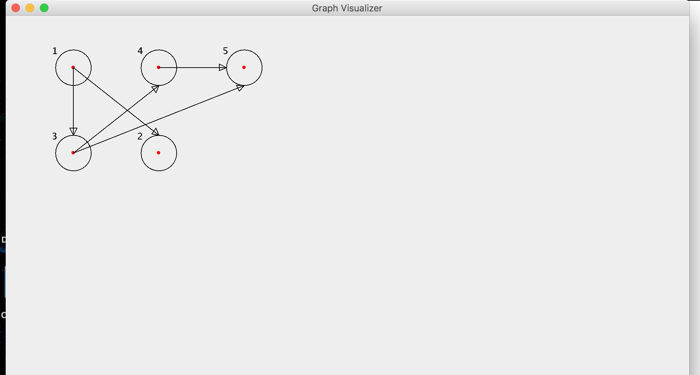

# Graph-Visualizer
A java-based tool to visualize graphs from their edge representations.

Use the below input format to generate your graphs - 
n m
srci desti
srci desti
...
srci desti

where,
n - number of nodes.
m - number of edges. 1 <= i <= m
src - source node in the ith edge
dest - destination node in the ith edge

